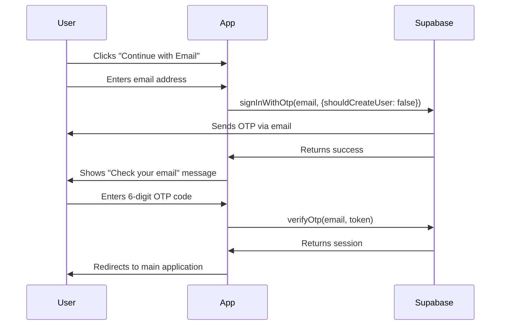
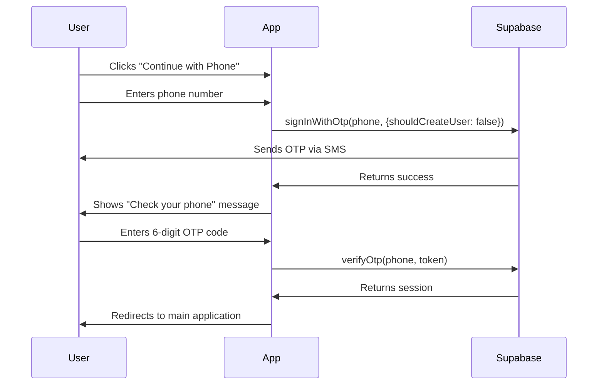

# Authentication Guide

## Overview

LLM Council uses Supabase for authentication with a **login-only** approach. Users cannot self-register; administrators must create accounts manually in the Supabase dashboard.

## Key Features

- **Email OTP Login**: Users receive a one-time password via email
- **Phone OTP Login**: Users receive a verification code via SMS
- **No Self-Registration**: The `shouldCreateUser: false` option prevents new user creation during login
- **Persistent Sessions**: Authenticated sessions are stored in localStorage and auto-refresh

## User Management

### Creating Users (Admin Only)

1. **Access Supabase Dashboard**
   - Navigate to: https://supabase.com/dashboard/project/kbayagkuoscmkqcjhzus
   - Sign in with your Supabase credentials

2. **Navigate to Authentication**
   - In the left sidebar, click **Authentication**
   - Click **Users** tab

3. **Add New User**
   - Click the **"Add user"** button
   - Select **"Create new user"**

4. **Enter User Details**

   **For Email Login:**
   - Enter the user's email address
   - Leave password field empty (OTP authentication doesn't use passwords)
   - Auto Confirm User: **Enable** (recommended)
   - Click **"Create user"**

   **For Phone Login:**
   - Enter the user's phone number in international format (e.g., `+15551234567`)
   - Leave password field empty
   - Auto Confirm User: **Enable** (recommended)
   - Click **"Create user"**

5. **User Can Now Login**
   - The user will be able to log in using their email or phone number
   - They will receive an OTP code to complete authentication

### Deleting Users

1. Go to **Authentication > Users**
2. Find the user in the list
3. Click the **three dots** menu on the right
4. Select **"Delete user"**
5. Confirm deletion

### User Metadata

You can add custom metadata to users for additional functionality:

1. Click on a user in the list
2. Scroll to **"User Metadata"** section
3. Add JSON data (e.g., `{"role": "admin", "department": "engineering"}`)
4. Click **"Save"**

## Authentication Flow

### Email Authentication



### Phone Authentication



## Environment Variables

### Local Development

Create a `.env` file in the project root:

```bash
# Backend
OPENROUTER_API_KEY=sk-or-v1-...
TAVILY_API_KEY=tvly-...

# Frontend (in frontend/.env)
VITE_SUPABASE_URL=https://kbayagkuoscmkqcjhzus.supabase.co
VITE_SUPABASE_ANON_KEY=your_supabase_anon_key
VITE_API_URL=http://localhost:8001
```

### Railway Deployment

**Frontend Service:**
- `VITE_SUPABASE_URL` - Your Supabase project URL
- `VITE_SUPABASE_ANON_KEY` - Your Supabase anonymous key (public, safe to expose)
- `VITE_API_URL` - Backend API URL

**Backend Service:**
- `OPENROUTER_API_KEY` - For LLM API calls
- `TAVILY_API_KEY` - For web search
- `FRONTEND_URL` - Frontend URL for CORS

## Supabase Configuration

### Required Supabase Settings

1. **Auth Providers**
   - Email: **Enabled**
   - Phone: **Enabled** (requires Twilio integration)

2. **Email Templates**
   - Navigate to: **Authentication > Email Templates**
   - Customize the "Magic Link" template for OTP emails
   - Ensure the template includes `{{ .Token }}` placeholder

3. **Phone Auth (Twilio)**
   - Navigate to: **Authentication > Providers > Phone**
   - Enable phone authentication
   - Add Twilio credentials:
     - Account SID
     - Auth Token
     - Phone Number (for sending SMS)

4. **Site URL**
   - Navigate to: **Authentication > URL Configuration**
   - Set **Site URL** to your frontend URL (e.g., `https://llm.cardinalconseils.com`)
   - Add to **Redirect URLs**: `https://llm.cardinalconseils.com/**`

5. **Disable Signups**
   - Navigate to: **Authentication > Providers**
   - For **Email**: Ensure "Enable email confirmations" is on
   - For **Phone**: Ensure "Enable phone confirmations" is on
   - The `shouldCreateUser: false` option in the code prevents signups

## Troubleshooting

### User Can't Login

**Error: "This email is not registered"**
- Solution: Create the user in Supabase dashboard first

**Error: "This phone number is not registered"**
- Solution: Create the user in Supabase dashboard with phone number

**OTP not received**
- Check spam/junk folder for email OTP
- Verify Twilio configuration for phone OTP
- Check Supabase logs: **Authentication > Logs**

### Session Issues

**User logged out unexpectedly**
- Check browser console for errors
- Verify Supabase URL and anon key are correct
- Clear browser localStorage and try again

**Token expired**
- Sessions auto-refresh by default
- Check `autoRefreshToken: true` in `frontend/src/lib/supabase.js`

## Security Best Practices

1. **Anon Key is Public**
   - The `VITE_SUPABASE_ANON_KEY` is safe to expose in frontend code
   - It has limited permissions (defined by Row Level Security)

2. **Row Level Security (RLS)**
   - Enable RLS on all tables in Supabase
   - Create policies that restrict access based on `auth.uid()`

3. **Service Role Key**
   - Store `SUPABASE_SERVICE_KEY` only in backend environment variables
   - Never expose this key in frontend code or version control

4. **CORS Configuration**
   - Backend API restricts CORS to allowed frontend origins
   - Update `FRONTEND_URL` environment variable when deploying

## Testing Authentication

### Local Testing

1. Start the backend:
   ```bash
   uv run python -m backend.main
   ```

2. Start the frontend:
   ```bash
   cd frontend
   npm run dev
   ```

3. Create a test user in Supabase dashboard

4. Navigate to http://localhost:5173

5. Test email or phone login flow

### Production Testing

1. Ensure Railway environment variables are set
2. Create a test user in Supabase dashboard
3. Navigate to your production URL
4. Verify OTP delivery and authentication flow

## Additional Resources

- [Supabase Auth Documentation](https://supabase.com/docs/guides/auth)
- [Supabase OTP Documentation](https://supabase.com/docs/guides/auth/auth-otp)
- [Row Level Security Guide](https://supabase.com/docs/guides/auth/row-level-security)
